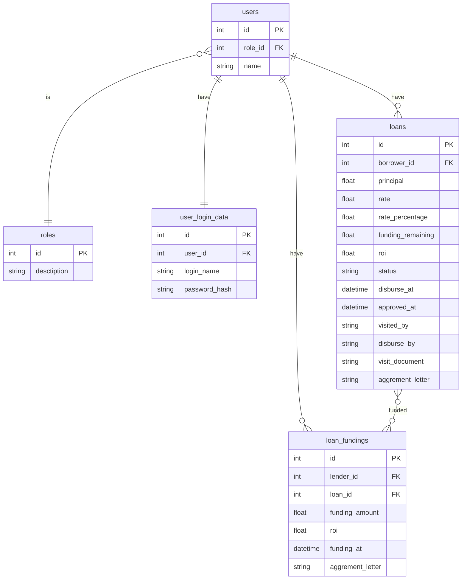

# Loans Service

## Database Designs



## API

### How to Run
```
mv .env.example .envrc
direnv allow .

make serve
```
### List API

```txt
POST http://0.0.0.0:2727/v1/user/login
{
  "user_name": "lender",
  "password": "12345"
}


GET http://0.0.0.0:2727/v1/assessment

PUT http://0.0.0.0:2727/v1/assessment/{loan_id}/{status}
{
  "document": "doc_visit",
  "employee_id": "12345",
  "execute_at": "2025-06-27T07:20:50.52Z"  
}


POST http://0.0.0.0:2727/v1/funding/{loan_id}
{
  "funding_amount": 1000000
}
```

## Cron

This cron will change status loan to `invested` when loan can not be fund anymore and will generate letter agreement for lender when loan already `invested`

```txt
mv .env.example .envrc
direnv allow .

make cron
```


