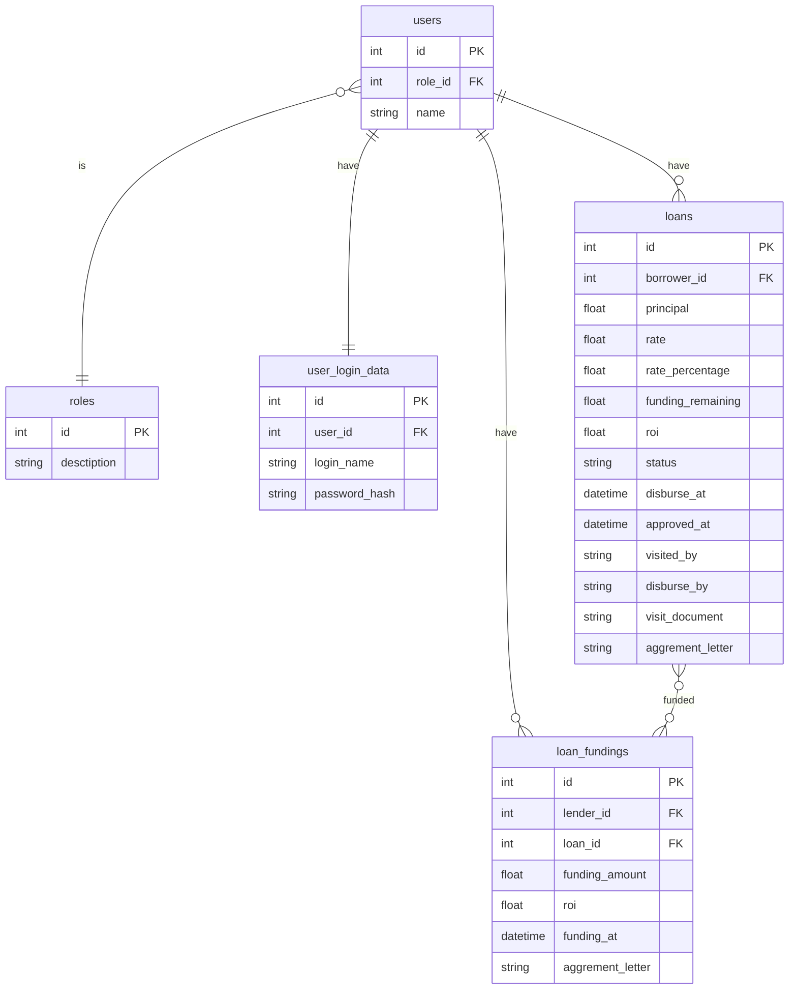

# Loans Service

## Database Designs

## Assumption
- Loan Proposed by borrower
    - Borrower can propose loan after previous loan disburse. 
- Rounding value for loan, funding amount, roi is 2 digits
-

## TODO
- jwt with role
- route loan -> create and update
- route loan/funding -> create

